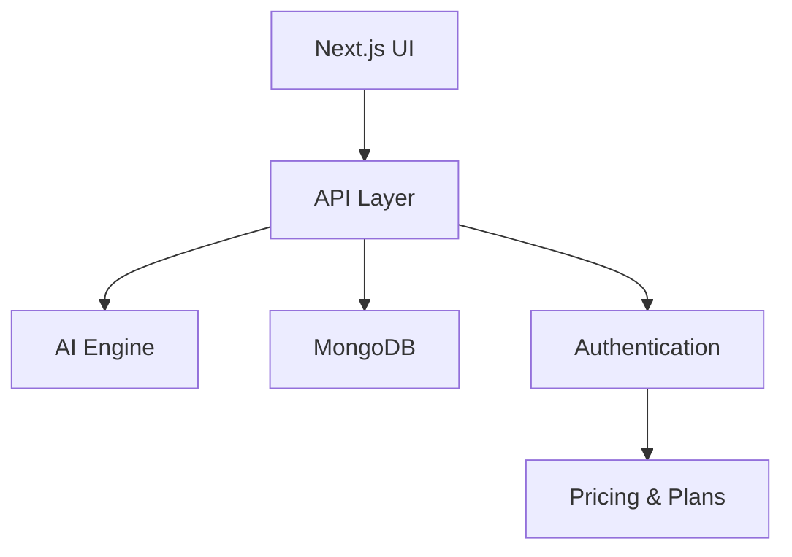

# Zynk

Zynk is an AI-powered chat platform built with **Next.js**, **TypeScript**, and **shadcn/ui**, designed to provide seamless AI conversations with secure authentication, chat management, pricing plans, and a polished, modern interface.

---

## 🚀 Features

* 🤖 **AI-Powered Chat** – Engage in intelligent real-time conversations
* 🗂️ **Chat Management** – Create, view, and delete conversations easily
* 🕒 **Persistent History** – Store and retrieve previous chats
* 🔐 **Authentication** – Secure login, signup, and session management
* 💳 **Pricing & Subscriptions** – Flexible plans for different users
* 🎨 **Modern UI** – Powered by **shadcn/ui** and **Tailwind CSS**

---

## 🛠️ Tech Stack

| Layer          | Technology                |
| -------------- | ------------------------- |
| Frontend       | Next.js + TypeScript      |
| Styling & UI   | TailwindCSS + shadcn/ui   |
| AI Integration | OpenAI / Custom LLMs      |
| Authentication | JWT / NextAuth / Sessions |
| Database       | **MongoDB**               |
| Payments       | Stripe / Other APIs       |

---

## ⚡ Getting Started

**Clone the repository:**

```bash
git clone https://github.com/ExploitEngineer/Zynk.git
cd Zynk
```

**Install dependencies:**

```bash
pnpm install
```

**Run the development server:**

```bash
pnpm dev
```

Now open [http://localhost:3000](http://localhost:3000) in your browser.

---

## 🧩 Architecture Overview



This diagram represents the flow of data and services in Zynk.

---

## 🤝 Contributing

We welcome contributions!

1. Fork the repo
2. Create your feature branch: `git checkout -b feature-name`
3. Commit changes: `git commit -m "Add new feature"`
4. Push to your branch: `git push origin feature-name`
5. Open a pull request

---

## 📜 License

This project is licensed under the **MIT License**.

---

## 📩 Contact

For inquiries, reach out at **[abdulrafayofficial.work@gmail.com](mailto:abdulrafayofficial.work@gmail.com)**.

---

Zynk – *Where AI Conversations Meet Simplicity & Power* 🚀
